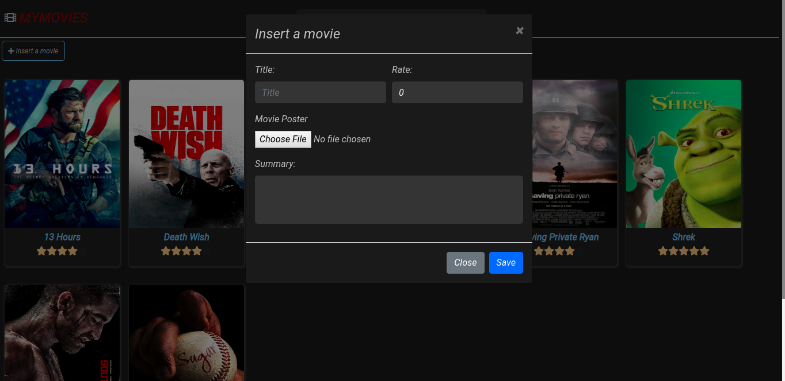

# MoviesCollection

Website to manage movies that you have watched. 

## Stack 
 * ReactJS
 * MongoDB
 * NodeJS  
## Dependencies

All dependencies for the server are available in package.json file, and for the client(ui) in the client folder as well. 
  #### How to install all dependencies?
    In order to install the dependencies used in this website, type in your terminal npm install package.json
   
## How to use it?
1. You can either create a free [Atlas Cluster](https://www.mongodb.com/cloud/atlas) or use the localhost version of MongoDB.
2. Create a file, in the root, named .env (this may disappear in your directory; i recommend you to use VsCode or another text editor). In that file put the informations about your database.
    1. Go to your cluster, and click connect;
    2. Click **Connect your application** ;
    3. Select NodeJs 3.6 or later, and copy the url provided.

3. Now, run this command in terminal: npm run dev. This command will execute server and client at the same time.

## Screenshots

## Important

If you want to add images, you have to place them in the img folder located in client/public/img. 
